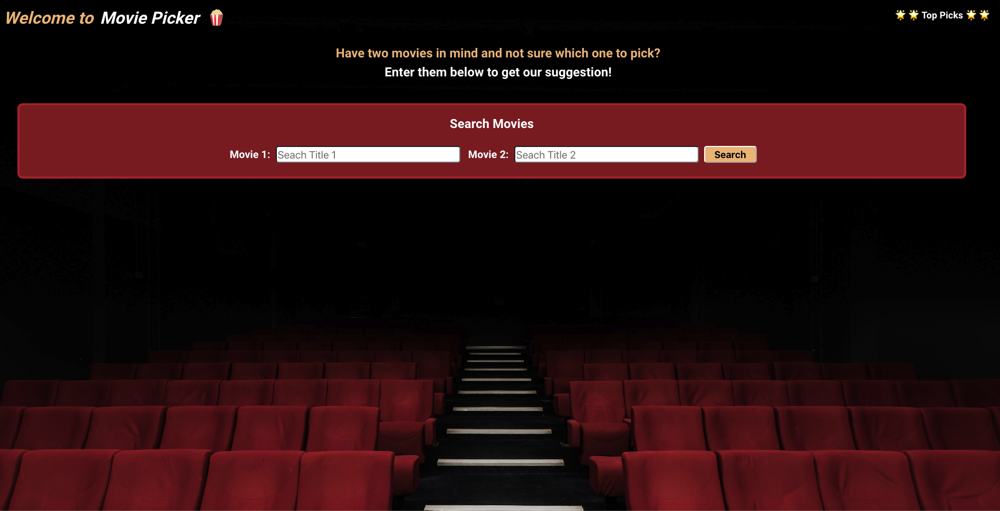
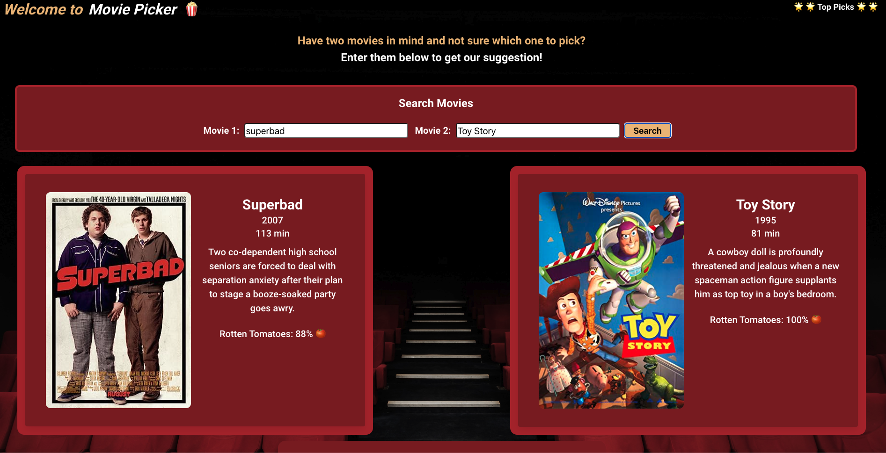
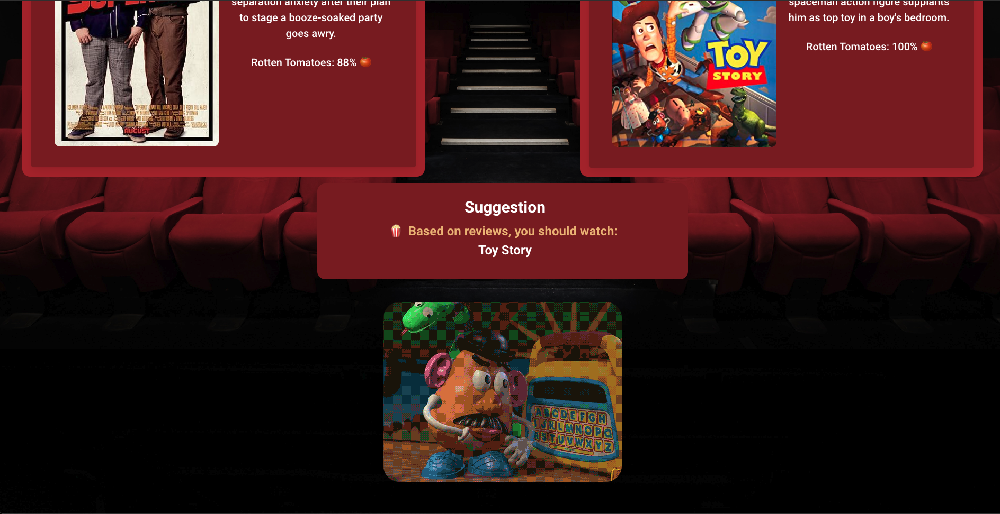
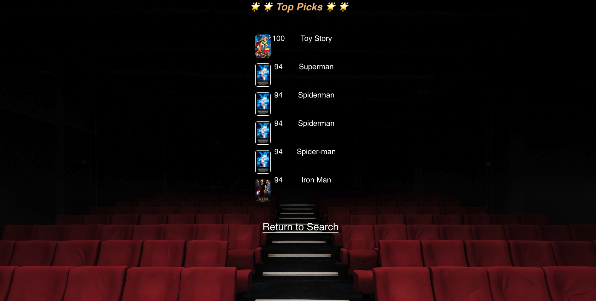

# <Team 1 Movie-picker>

sjbdlt:
-Most people watch movies and most people have a hard time choosing what to watch.
-Figured we try and help people make a more informed and quicker choice.
-Provides more information to a person about the movies they are considering and also could breaks a tie to have a third party suggestion.
-Learned that more information out there than i thought about movies then just year made, title and who stared in it.
-Also provided some random triva information to help spark conversation or thoughts of another movie to watch another time.

User story:

As a movie aficionado,
I want help picking between two movies
to determine which movie to watch based off the ratings from Rotten Tomatoes.

User Acceptance:

GIVEN a section with two input boxes and a search button are setup for user to enter in movie titles
WHEN I search two movie titles
THEN a section with two display areas for moview one information and movie two information. (Items to retrieve from API Movie Title, Premiere Date,  Brief description and movie poster image if available).
WHEN the two movies are displayed
THEN user sees what movie we suggest in the suggestion section based on Rotten Tomatoe reviews
WHEN the movie is suggested
THEN a gif of the suggested movie is displayed 
WHEN I click on the Top Picks links
THEN lookup information is stored to local storage and I can see it on Top Picks page

## Description

- What was your motivation?
  - (RF) The motivation for this project is to utilize client-side APIs and have the API information work together to fulfill our User Story and our Acceptance Criteria 
- Why did you build this project? (Note: the answer is not "Because it was a homework assignment.")
  - (RF) We decided to build this project to utilize public APIs to hone in our skill and collaborate as a team.
- What problem does it solve?
  - (RF) We resolved a problem of deciding between two movies.
- What did you learn?
  - (RF) We learned a new CSS frame work called BULMA and how to troubleshoot when APIs fail. 

## Installation

To install this application, simply click on this link to open it in your web browser.

## Usage

Search two different movies in the input fields and click the search button. The application will then generate information about the two movies
and suggest which movie to watch based off of the Rotten Tomatoes score. Then, a GIF of the suggested movie will be displayed. You can view past top picks
by clicking on the top picks link in the top right side of the page. The following screenshots show how to use the application.

    
    
    
    
    
    

## Credits

Dylan Horyza https://github.com/dylanhoryza
Ricardo Farfan https://github.com/Chasqui10
Steven Blake https://github.com/sjbdlt

## License

N/A

---

